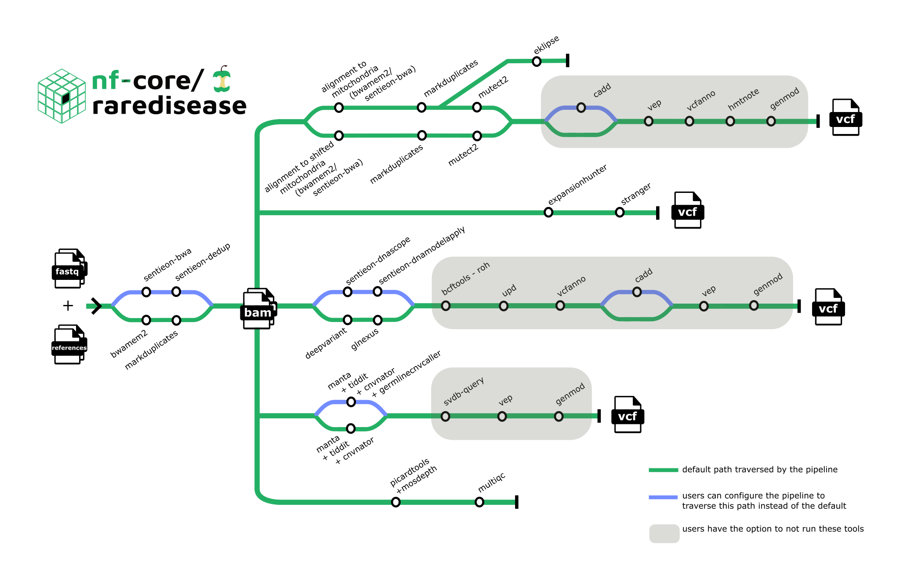

<h1>
  <picture>
    <source media="(prefers-color-scheme: dark)" srcset="docs/images/nf-core-raredisease_logo_dark.png">
    
  </picture>
</h1>

[](https://www.nextflow.io/)
[](https://docs.conda.io/en/latest/)
[](https://www.docker.com/)
[](https://sylabs.io/docs/)
[](https://tower.nf/launch?pipeline=https://github.com/nf-core/raredisease)

[](https://nfcore.slack.com/channels/raredisease)[](https://twitter.com/nf_core)[](https://mstdn.science/@nf_core)[](https://www.youtube.com/c/nf-core)

## Introduction

**nf-core/raredisease** is a best-practice bioinformatic pipeline for calling and scoring variants from WGS/WES data from rare disease patients. This pipeline is heavily inspired by [MIP](https://github.com/Clinical-Genomics/MIP).

The pipeline is built using [Nextflow](https://www.nextflow.io), a workflow tool to run tasks across multiple compute infrastructures in a very portable manner. It uses Docker/Singularity containers making installation trivial and results highly reproducible. The [Nextflow DSL2](https://www.nextflow.io/docs/latest/dsl2.html) implementation of this pipeline uses one container per process which makes it much easier to maintain and update software dependencies. Where possible, these processes have been submitted to and installed from [nf-core/modules](https://github.com/nf-core/modules) in order to make them available to all nf-core pipelines, and to everyone within the Nextflow community!

On release, automated continuous integration tests run the pipeline on a full-sized dataset on the AWS cloud infrastructure. This ensures that the pipeline runs on AWS, has sensible resource allocation defaults set to run on real-world datasets, and permits the persistent storage of results to benchmark between pipeline releases and other analysis sources. The results obtained from the full-sized test can be viewed on the [nf-core website](https://nf-co.re/raredisease/results).

## Pipeline summary

<p align="center">
    
</p>

**2. Alignment:**

- [Bwa-mem2](https://github.com/bwa-mem2/bwa-mem2)
- [BWA](https://github.com/lh3/bwa)
- [Sentieon DNAseq](https://support.sentieon.com/manual/DNAseq_usage/dnaseq/)


> [!NOTE]
> If you are new to Nextflow and nf-core, please refer to [this page](https://nf-co.re/docs/usage/installation) on how to set-up Nextflow. Make sure to [test your setup](https://nf-co.re/docs/usage/introduction#how-to-run-a-pipeline) with `-profile test` before running the workflow on actual data.

First, prepare a samplesheet with your input data that looks as follows:

`samplesheet.csv`:

```csv
sample,lane,fastq_1,fastq_2,sex,phenotype,paternal_id,maternal_id,case_id
hugelymodelbat,1,reads_1.fastq.gz,reads_2.fastq.gz,1,2,,,justhusky
```

Each row represents a fastq file (single-end) or a pair of fastq files (paired end).

Second, ensure that you have defined the path to reference files and parameters required for the type of analysis that you want to perform. More information about this can be found [here](https://github.com/nf-core/raredisease/blob/dev/docs/usage.md).

Now, you can run the pipeline using:

```bash
nextflow run nf-core/raredisease \
   -profile <docker/singularity/podman/shifter/charliecloud/conda/institute> \
   --input samplesheet.csv \
   --outdir <OUTDIR>
```

> [!WARNING]
> Please provide pipeline parameters via the CLI or Nextflow `-params-file` option. Custom config files including those provided by the `-c` Nextflow option can be used to provide any configuration _**except for parameters**_;
> see [docs](https://nf-co.re/usage/configuration#custom-configuration-files).


You can cite the `nf-core` publication as follows:

> **The nf-core framework for community-curated bioinformatics pipelines.**
>
> Philip Ewels, Alexander Peltzer, Sven Fillinger, Harshil Patel, Johannes Alneberg, Andreas Wilm, Maxime Ulysse Garcia, Paolo Di Tommaso & Sven Nahnsen.
>
> _Nat Biotechnol._ 2020 Feb 13. doi: [10.1038/s41587-020-0439-x](https://dx.doi.org/10.1038/s41587-020-0439-x).

You can read more about MIP's use in healthcare in,

> Stranneheim H, Lagerstedt-Robinson K, Magnusson M, et al. Integration of whole genome sequencing into a healthcare setting: high diagnostic rates across multiple clinical entities in 3219 rare disease patients. Genome Med. 2021;13(1):40. doi:10.1186/s13073-021-00855-5
